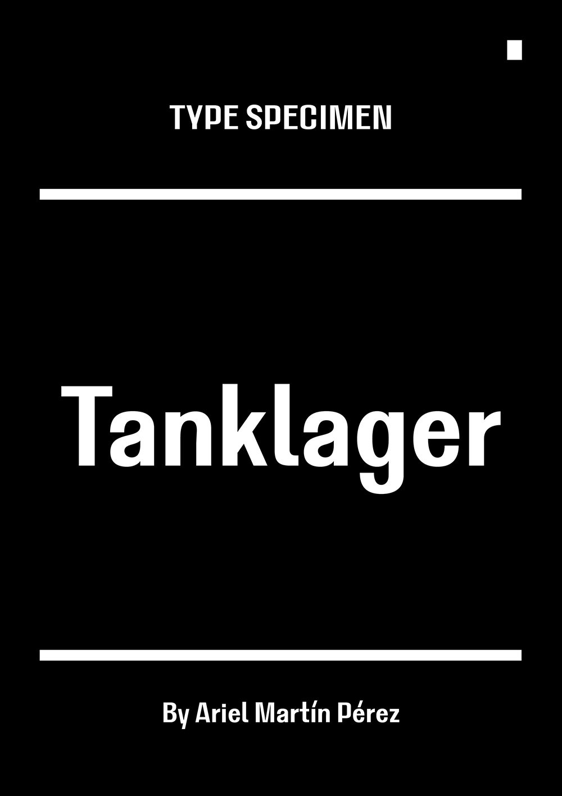
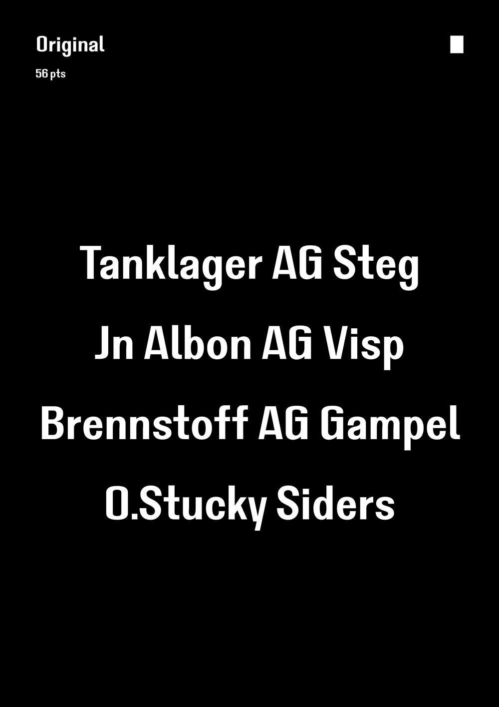
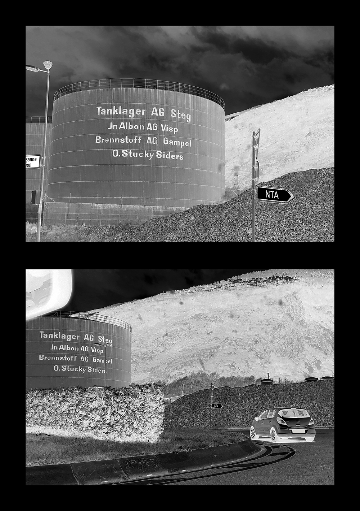
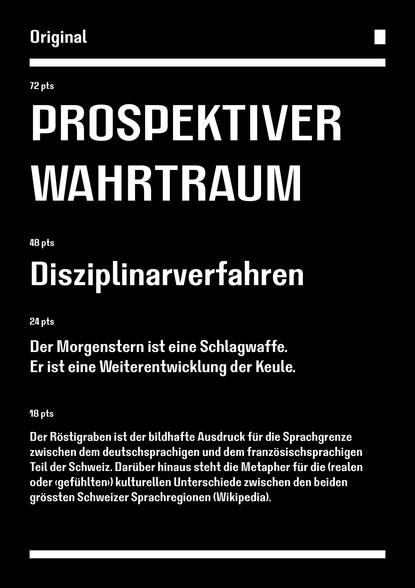
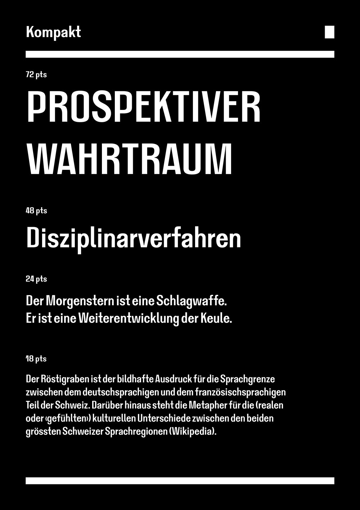

# Tanklager

<strong>[EN]</strong>

Tanklager ("tank farm" in German) is a typeface inspired by a weird hand-painted sign found on the side of an oil tank in Visp, Switzerland. Tanklager made its debut in the 9th issue of a review called Jef Klak, which was dedicated to ingestion and digestion. Its type design is a mixture of DIN and grotesk features, where capital and lowercase letters sometimes have different structures. Some shapes are blatantly recycled, like the f and the t; sometimes there aren't enough optical corrections and sometimes they are pushed too hard, like in the X or in the letter apexes. The diacritics are very geometrical and they're having a blast. The typeface comes in two cuts: Original (its width is similar to that of the original sign) and Kompakt (for more effective titles). The category is: all the dirty tricks at once.

Tanklager has been created by Ariel Martín Pérez (https://tainome.com/ - contact@tainome.com) and released under the SIL Open Font Licence 1.1 in 2024. Tanklager is distributed by Tunera Type Foundry (www.tunera.xyz).

To know how to use this typeface, please read the FAQ (http://www.tunera.xyz/f.a.q/)

<strong>[FR]</strong>

Tanklager ("parc à cuves" en allemand) est un fonte typographique basée sur un signe peint à la main trouvé sur le côté d'une cuve à essence à Visp, Suisse. Tanklager a fait son début éditorial dans le neuvième numéro de la revue Jef Klak, dédié aux sujets de l'ingestion et la digestion. Son dessin typographique est un mélange entre des caractères DIN et grotesk, avec parfois des structures différentes pour les lettres en capitales et en bas-de-case. Quelques formes de lettres ont été récyclées sans ménagement, comme le t et le f ; parfois il y a une absence de corrections optiques et parfois elles ont été poussées à l'extrème, comme dans la lettre X ou dans les sommets des lettres. Les diacritiques ont des formes très géométriques et elles sont en train de s'éclater. La fonte est disponible en deux versions : Original (sa largeur est similaire à celle du signe d'origine) et Kompakt (pour des titres plus impactants). Sa catégorie est : tous les coups bas en même temps.

Tanklager a été créé par Ariel Martín Pérez (https://tainome.com/ - contact@tainome.com) et publié sous la licence SIL Open Font License 1.1 en 2024. Tanklager est distribué par Tunera Type Foundry (www.tunera.xyz).

Pour savoir comment utiliser cette fonte, veuillez lire la FAQ (http://www.tunera.xyz/fr/f.a.q/)

<strong>[ES]</strong>

Tanklager ("almacén de tanques" en alemán) es un tipo de letra inspirado por un extraño letrero rotulado a mano que se encuentra en el lateral de un tanque de gasolina en Visp, Suiza. Tanklager fue usado por primera vez en el noveno número de la revista Jef Klak, dedicado a la ingestión y la digestión. Su diseño tipográfico es una mezcla de características de tipo DIN y grotesca, en el cual las mayúsculas y las minúsculas a veces tienen estructuras diferentes. Algunas formas de letras han sido impunemente recicladas, como las letras f y t; mientras que a veces no hay suficientes correcciones ópticas, otras veces hay demasiadas, como en la letra X o en los extremos superiores de las letras. Los signos diacríticos son muy geométricos y se lo están pasando bomba. El tipo de letra tiene dos versiones: Original (su anchura es similar a la del letrero original) y Kompakt (para componer títulos más impactantes). La categoría es: todos los trucos sucios a la vez.

Tanklager ha sido creado por Ariel Martín Pérez (https://tainome.com/ - contact@tainome.com) y publicado bajo la licencia SIL Open Font License 1.1 en 2024. Tanklager es distribuido por Tunera Type Foundry (www.tunera.xyz).

Para saber cómo usar este tipo de letra, lea las preguntas frecuentes (http://www.tunera.xyz/sp/f.a.q/)

## Specimen

## License

Tanklager is licensed under the SIL Open Font License, Version 1.1.
This license is copied below, and is also available with a FAQ at
http://scripts.sil.org/OFL

## Repository Layout

This font repository follows the Unified Font Repository v2.0,
a standard way to organize font project source files. Learn more at
https://github.com/unified-font-repository/Unified-Font-Repository
